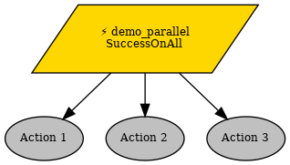

# How to make leaves....grow a tree?
Ciao!!  
Leaves are components of a behaviour tree, where actual functionality of a task is defined and updates regarding an action is maintained. Essentially it is a subclass of a ```pytree``` class, ```py_trees.behaviour.Behaviour```.  
A detailed documentation of ```pytree``` can be found [here](https://py-trees.readthedocs.io/en/devel/).  
Now let's see how can we put to this to our use for creating a decision process.  
In a behaviour tree, we define something called a "tick". When a leaf is "tick"ed, it returns the status of execution od task that it is supposed to do(like a text-to-speech leaf is supposed to send a request to Amazon polly server for converting a text segment to speech). The result of the tick can be SUCCESS, FAILURE, INVALID or RUNNING. The meaning of these status can be looked up [here](https://py-trees.readthedocs.io/en/devel/behaviours.html).  
But how does the "tick"ing return the status?? We need to return the status of the task in an override function called "update". And like this function, there are other functions which are used for defining a task for leaf.  
### ```__init__()```
This function is called when creating an instance of this class. Usually, one-time initializations are included here.  
>Harmoni usually uses this for initialising blackboard and their keys.

### ```setup()```
This function is usually called manually(that is, does not get called by "tick"). Hence delayed one-time initializations are included here.  
>Harmoni uses this for setting up action client which establishes connection with the corresponding harmoni action server, for sending goals to the sever.

### ```initialise()```
Ahhh....again a method initialisation, but this is called whenever the leaf is "tick"ed. We will soon get to the ticking business, but usually those initializations are done which are required before every RUN of the task.  
>Harmoni uses this for....nothing. Yeah, most of the leaves do not use this for anything serious(just used for logging info)

### ```update()```
This is where the main business is carried out. This method is also called when the leaf is "tick"ed, so the goals of the task are sent here. The status of the task(SUCCESS, FAILURE, INVALID or RUNNING) is returned.  
**This method must be _non-blocking_, since immediate status of the task is required to be returned.**
>Harmoni uses this method to send goals to the action server using the action client. The result callback and feedback callback of the action client are used for updating the state of variables according to the result. Also the state of the task is also maintained by fetching the state of the goal given to the server.

### ```terminate()```
This method is called when a "tick" returns a non-RUNNING state, which are SUCCESS, FAILURE, INVALID.
>Harmoni uses this for setting up new goal for the harmoni action server. All the previous goals sent to the server are cancelled in case there are any pending goals.  

Therefore, to construct a leaf with a specific functionality, the above functions should be defined appropitely in a class having `py_trees.behaviour.Behaviour` as a parent class.

# How to grow trees?

Constructing a leaf would certainly not satisfy our [endless] needs, and we often need to make complex behaviour trees. This can be achieved by combining leaves in one of the following ways:

1. Sequence: In a sequence composition of leaves, ticks are progressively carried out over the defined sequence untill a RUNNING or FAILURE status is returned. In case of last child, the result is adopted regarless.
2. Selector: This composite is used to prioritize leaves. The childeren are executed untill one of them succeeds. In case it runs out of children, FAILURE is returned.
3. Parallel: Leaves in this composite are ticked in parallel. This is useful for tasks which are required to be done simultaneously, like speaking and facial expressions. The return value depends on the policy used for parallelism. Details can be found [here](https://py-trees.readthedocs.io/en/devel/composites.html#:~:text=Parallels%20will%20return%20FAILURE,of%20children%20return%20SUCCESS)

Using the above composites on leaves yields an instance of `py_trees.behaviour.Behaviour` and hence the composition can be applied again. This way more complicated trees can be constructed.  
After making a composite of leaves, there are other things you can add to the behaviour tree which are not necesssary but make our lives easier, especially in debugging purposes. These are:  

1. [add_post_tick_handler()](https://py-trees.readthedocs.io/en/devel/modules.html#:~:text=instance%20of%20Behaviour-,add_post_tick_handler,-(handler)): Using this you can add a method which would be called upon every time before after a tick is made.
2. [add_pre_tick_handler()](https://py-trees.readthedocs.io/en/devel/modules.html#:~:text=func\)%20%E2%80%93%20function-,add_pre_tick_handler,-(handler)): Similar to the above method, a method can be added to the behaviour tree which would be called before a tick is made.
3. [visitors.append()](https://py-trees.readthedocs.io/en/devel/modules.html#:~:text=behaviour_tree.visitors.append): A snapshot visitor, like `py_trees.visitors.SnapshotVisitor()` visits the ticked part of a tree, checking off the status against the set of status results recorded in the previous tick.  
What's more? You can also render the behaviour tree as a graph for visualization purpoes. This can be achieved by, 
```bash
py_trees.display.render_dot_tree(arg)
```
where `arg` is the instance of `py_trees.behaviour.Behaviour`(basically the subtree) that you would like to render. The output can be generated as `*.png`, `*.dot` or `*.svg`. Below is an example of a parallel composite:  



The composite used for creating the above tree is as follows:
```python
def create_root():
    children = []
    for idx, action in enumerate(["Action 1", "Action 2", "Action 3"]):
        children.append(py_trees.behaviours.Count(name=action,
                                                      fail_until=1,
                                                      running_until=2,
                                                      success_until=10))
    root = py_trees.composites.Parallel(name="demo_parallel")
    root.add_children(children)
    return root
```

As a conclusion, in order to make a comple behaviour tree, the relevant leaves ae required to be defined, and then progressively composites are required to be applied for defining the decision making process. Optionally, post_tick method, pre_tick method and snapshot visiter can be used for added functionality.  


For detailed documentation on composites click [here](https://py-trees.readthedocs.io/en/devel/composites.html). 
## How to run subtrees?
To run the subtrees, the esy way is to make a launch file which shall include all the nodes(or other launch files for running them) whose service, the subtree under concern requires. The launch should also run that subtree file. Generally the process of ticking takes place in the main of subtree file. An example of launch file can be found [here](../../../launch/subtrees/root.launch).  
